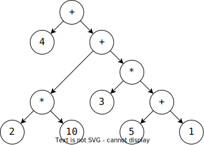
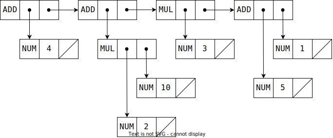

In [a previous blog post](/one-pass-compiler-primer), we looked at a simple one-pass compiler written in C.
Now, let's look at how we can design an *abstract syntax tree* and work with it.

An abstract syntax tree (or an AST) is a tree-shaped representation of source code that is convenient for a compiler to operate.
A compiler might represent an expression like `4 + 2 * 10 + 3 * (5 + 1)` using a tree structure like this:



In object-oriented languages, it is common to represent an AST using a hierarchy of data classes, one subclass per tree node.
In functional languages, it is common to use a variant data type, in other words, a *tagged union*, with one variant per tree node.
C does not have good support for either of those language features.
However, we can manually implement a tagged union.
Here's how we can do that.

## Tagged union

We define our AST type as a `struct` holding two members,

 * an `enum` called `tag`, enumerating each node type, and
 * a `union` called `data`, consisting of data members for each tag type.

```c
typedef struct AST AST; // Forward reference

struct AST {
  enum {
    AST_NUMBER,
    AST_ADD,
    AST_MUL,
  } tag;
  union {
    struct AST_NUMBER { int number; } AST_NUMBER;
    struct AST_ADD { AST *left; AST *right; } AST_ADD;
    struct AST_MUL { AST *left; AST *right; } AST_MUL;
  } data;
};
```

We want data members to reference other AST nodes, and since C does not allow recursive type definitions, we make a forward reference by defining `AST` as `struct AST`.
We can do this because the namespace of `struct`s and the namespace of types are separate in C.

In this tagged union implementation, an identifier like `AST_NUMBER` is mentioned three times:

* first, as an `enum` member,
* second, as the name of the `struct`, and
* third, as the name of the data member.

C does not have a built-in concept of a tagged union, so there are many ways to implement it.
You could name the `enum` and the `union` types, for example, and define them separately.
Or, you could use an anonymous `union` or `struct` (standard since C11).
You can decide not to wrap a single member into a `struct`, like in the case of `int number`.
However, the design chosen here has some advantages that we will discuss further.

With `AST` defined this way, our original example (`4 + 2 * 10 + 3 * (5 + 1)`) has the following layout in memory.



To heap-allocate an AST node we can use a function like this:

```c
AST *ast_new(AST ast) {
  AST *ptr = malloc(sizeof(AST));
  if (ptr) *ptr = ast;
  return ptr;
}   
```

Now, we can represent an expression `5 + 1` using the following code:


```c
  AST *term_ = ast_new((AST){
    AST_ADD, 
    {
      .AST_ADD=(struct AST_ADD){
        ast_new((AST){
          AST_NUMBER, 
          {.AST_NUMBER=(struct AST_NUMBER){5}}
        }),
        ast_new((AST){
          AST_NUMBER, 
          {.AST_NUMBER=(struct AST_NUMBER){1}}}
        ),
      }
    }
  });
```

This is just C being C, isn't it?
There is no local type inference, so we must cast each `struct` to the correct type.
We also have to use designated initializers (like `.AST_ADD=`) because that's the only way to initialize an arbitrary union in a single expression.

To some extent, we even asked for it when we wrapped the harmless `int number` into a `struct AST_NUMBER`.

However, C being C, we can create a vararg macro that can reduce this boilerplate:

```c
#define AST_NEW(tag, ...) \
  ast_new((AST){tag, {.tag=(struct tag){__VA_ARGS__}}})
```

This macro ties together the matching identifiers from the `enum`, the `struct`, and the data members.
With this, we can initialize `4 + 2 * 10 + 3 * (5 + 1)` as follows.

```c
  AST *term = 
    AST_NEW(AST_ADD,
      AST_NEW(AST_NUMBER, 4),
      AST_NEW(AST_ADD,
        AST_NEW(AST_MUL, 
          AST_NEW(AST_NUMBER, 2), 
          AST_NEW(AST_NUMBER, 10),
        ),
        AST_NEW(AST_MUL,
          AST_NEW(AST_NUMBER, 3),
          AST_NEW(AST_ADD,
            AST_NEW(AST_NUMBER, 5),
            AST_NEW(AST_NUMBER, 1),
          ),
        ),
      ),
    );
```

We could even shorten `AST_NEW(AST_ADD, …)` to `AST(ADD, …)` with token concatenation (`##` macro operator), but that is beyond my taste in C programming.

Now, how do we operate with this AST…


## Pretty-printing example

A common way to operate on a tagged union is to use something like a `switch` statement, which switches over the tag value, where each case operates on the corresponding data value.


```c
void ast_print(AST *ptr) {
  AST ast = *ptr;
  switch (ast.tag) {
    case AST_NUMBER: {
      struct AST_NUMBER data = ast.data.AST_NUMBER;
      printf("%d", data.number);
      return;
    }
    case AST_ADD: {
      struct AST_ADD data = ast.data.AST_ADD;
      printf("(");
      ast_print(data.left);
      printf(" + ");
      ast_print(data.right);
      printf(")");
      return;
    }
    case AST_MUL: {
      struct AST_MUL data = ast.data.AST_MUL;
      printf("(");
      ast_print(data.left);
      printf(" * ");
      ast_print(data.right);
      printf(")");
      return;
    }
  }
}
```

A modern compiler like `gcc` or `clang` will detect that you are using an `enum` type in the switch statement and will warn if the switch is not exhaustive.
Use the flag `-Wswitch` to ensure that, and `-Werror` to make it an error.

A common error is forgetting a `break` or a `return` at the end of each statement, thus triggering a fall-through that can lead to some hard-to-debug bugs.
Use `-Wimplicit-fallthrough` to require an explicit annotation if you want the fall-through behaviour and warn otherwise.
The exact annotation syntax varies with other flags, but usually, `__attribute__((fallthrough))` works.

With all these warnings enabled, the experience of using tagged unions in C is not that bad, huh?
The one serious issue is that C will not stop you from accessing the wrong union member.
For example, you can match on `AST_NUMBER`, but then query for `ast.data.AST_MUL.left`.

To somewhat counter that, I suggest the programming style where each case is immediately followed by binding the correct union member as `data`, like this:

```c
    case AST_NUMBER: {
      struct AST_NUMBER data = ast.data.AST_NUMBER;
      printf("%d", data.number);
      return;
    }
```

Here, our matching naming pays off, I think.
It makes it easy to code review that we are accessing the correct union data, and if we accidentally use the wrong union member down the line, it will scream at us something like `ast.data.AST_ADD`.

We could extract this pattern into a `CASE` macro, but this is also beyond me.


## Deallocation example

We've looked at how we can allocate AST nodes using `ast_new` function and `AST_NEW` macro.
Let's write deallocation function to match that.
We will use a similar technique to our `ast_print` function.

```c
void ast_free(AST *ptr) {
  AST ast = *ptr;
  switch (ast.tag) {
    case AST_NUMBER: {
      struct AST_NUMBER data = ast.data.AST_NUMBER;
      break;
    }
    case AST_ADD: {
      struct AST_ADD data = ast.data.AST_ADD;
      ast_free(data.left);
      ast_free(data.right);
      break;
    }
    case AST_MUL: {
      struct AST_MUL data = ast.data.AST_MUL;
      ast_free(data.left);
      ast_free(data.right);
      break;
    }
  } 
  free(ptr);
}   
```

## Code generation

Let's make a simple code generator that emits x86-64 Intel assembly.
Similar to what we did for the [one-pass compiler](/one-pass-compiler-primer).

```c
#define emitf printf

void ast_emit(AST *ptr) {
  AST ast = *ptr;
  switch (ast.tag) {
    case AST_NUMBER: {
      struct AST_NUMBER data = ast.data.AST_NUMBER;
      emitf("  mov rax, %d\n", data.number);
      return;
    }
    case AST_ADD: {
      struct AST_ADD data = ast.data.AST_ADD;
      ast_emit(data.left);
      emitf("  push rax\n");
      ast_emit(data.right);
      emitf("  pop rbx\n");
      emitf("  add rax, rbx\n");
      return;
    }
    case AST_MUL: {
      struct AST_MUL data = ast.data.AST_MUL;
      ast_emit(data.left);
      emitf("  push rax\n");
      ast_emit(data.right);
      emitf("  pop rbx\n");
      emitf("  mul rbx\n");
      return;
    }
  }
}
```

This code generator will be able to compile our expressions to snippets of assembly.
However, to generate a complete program, we need an entry point.
Let's add that as a new node `AST_MAIN`, as well as the corresponding functions:

```c
struct AST {
  enum {
    AST_MAIN,
    …
  } tag;
  union {
    struct AST_MAIN { AST *body; } AST_MAIN;
    …
  } data;
};

…

void ast_emit(AST *ptr) {
  …
    case AST_MAIN: {
      struct AST_MAIN data = ast.data.AST_MAIN;
      emitf(".global main\n");
      emitf("main:\n");  // "_main" on macOS
      ast_emit(data.body);
      emitf("  ret\n");
      emitf("\n");
      return;
    }
  …
}
```

Now, if we pass our example AST (`4 + 2 * 10 + 3 * (5 + 1)`) to `ast_emit`, we will get the following assembly code:

```gnuassembler
.global main
main:
  mov rax, 4
  push rax
  mov rax, 2
  push rax
  mov rax, 10
  pop rbx
  mul rbx
  push rax
  mov rax, 3
  push rax
  mov rax, 5
  push rax
  mov rax, 1
  pop rbx
  add rax, rbx
  pop rbx
  mul rbx
  pop rbx
  add rax, rbx
  pop rbx
  add rax, rbx
  ret
```

Let's use `gcc test.s -masm=intel -o test.exe` as the command to assemble and link it, and we get the expected output:

```sh
$ ./test.exe 

$ echo $?
42
```

42. Which is the result of `4 + 2 * 10 + 3 * (5 + 1)`.

Thank you for your attention. [☰](/ "Home")

## Newsletter

> Subscribe to receive an occasional email from me about compilers, functional programming, or my book [Compiling to Assembly from Scratch](/compiling-to-assembly-from-scratch).
>
> <script async data-uid="8529ea38b4" src="https://motivated-writer-7421.ck.page/8529ea38b4/index.js"></script>
>
> Unsubscribe at any time.
>

## Bonus: OCaml version

Are you still considering using C for writing a compiler?
Consider again!
Here's the same example written in OCaml with complete type and memory safety:

```ocaml
type ast = 
  | Main of ast 
  | Number of int 
  | Add of ast * ast
  | Mul of ast * ast

let emitf x = Printf.kprintf print_endline x

let rec emit = function
  | Main body ->
      emitf ".global main";
      emitf "main:";
      emit body;
      emitf "  ret"
  | Number n ->
      emitf "  mov rax, %d" n
  | Add (left, right) ->
      emit left;
      emitf "  push rax";
      emit right;
      emitf "  pop rbx";
      emitf "  add rax, rbx"
  | Mul (left, right) ->
      emit left;
      emitf "  push rax";
      emit right;
      emitf "  pop rbx";
      emitf "  mul rbx"
```

## [Source code](https://gist.github.com/keleshev/6efbf2fc521b2f0797decb19c6932ecc)

## Citation

<small>
```
@misc{Keleshev:2022-1,
  title="Abstract Syntax Tree: an Example in C",
  author="Vladimir Keleshev",
  year=2022,
  howpublished=
    "\url{https://keleshev.com/abstract-syntax-tree-an-example-in-c}",
}
```
</small>


