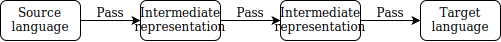
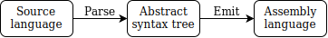

```{=html}
<h1>Compiling to Assembly<small><small><br/>from Scratch</small></small><br/></h1>
<center><p> — <a href='./#table-of-contents'>Table of Contents</a> — </p></center>
<span id="fold"> </span>
<h1><br/><small><small>Chapter 3</small></small><br/>High-level Compiler Overview<br/><br/></h1>
```

\newpage
\begin{center}\rule{0.5\linewidth}{0.5pt}\end{center}
\newpage
\part{Baseline Compiler}

\chapter{High-level Compiler Overview}
\includegraphics{chapter-illustrations/3.png}
\newpage

A *compiler* is a program that translates another program from one language to another.

In our case, it transforms from what we call the *baseline language* to ARM assembly language.

## Types of compilers

Our compiler will be an *ahead-of-time* (AOT) compiler.
Only once the compilation is finished can the resulting program be run.

There are also *just-in-time* (JIT) compilers that compile a program as it runs.

Think of AOT compilers as translator services for foreign languages: you might send them a few papers to translate from English to Japanese, and when they are done, they send the results back.
On the other hand, JIT compilers are more like simultaneous translators at a business meeting: they translate participants as they speak.

Our compiler *targets* an *assembly language*, i.e. produces assembly code.
An *assembly language* is a textual representation of a binary *machine language* that processors can execute directly.
It has a straightforward translation to such binary.
Such translation is called *assembling* and is much less sophisticated than what is found in a compiler.
The program that performs this translation is called an *assembler*.
In most cases for ARM, one assembly instruction is translated into one 32-bit binary integer.
Think of assembly language as an API for directly accessing your processor's functionality.

Some compilers target binary *machine code* directly, but this is increasingly rare.
Instead, most compilers compile to assembly and then call the assembler behind the scenes.

Some compilers target *byte code* instead of assembly.
Byte code is similar to assembly: it consists of similar instructions.
However, these do not target a real processor, but instead an *abstract machine*, which is a processor that is implemented in software.
This could be done for portability reasons, or to add security features that are not available in the hardware.
Often byte code, in turn, is translated to machine code by a JIT compiler.

A possible compiler target could be another programming language.
We call these compilers *source-to-source* compilers.
For example, the TypeScript compiler is a source-to-source compiler that targets JavaScript.

## Compiler passes and intermediate representations

Compilers are structured into several *passes*.
At the high-level, each pass is a function that takes one representation of the program and converts it to a different representation of the program.
The first such representation is the source of the program.
The last one is the compiled program in the target language.
In between them, we have representations that are *internal* to the compiler.
We call them *intermediate representations* or IR.

In the figure you can see an example diagram of a three-pass compiler.



Intermediate representations of a program are data structures convenient for us to manipulate at different stages of the compiler.
For one stage, we might want to use a tree-like representation.
For another, we might pick a graph-like one.
For some, a linear array-like representation is appropriate.

To convert from one IR to another one, each pass needs to traverse it once (or iterate through it).
That's why it's called a *pass*.

The number of passes in a compiler ranges wildly, from single-pass compilers to multiple-pass compilers with dozens of passes (sometimes called *nano-pass* compilers).

The number of compiler passes presents a trade-off.
On the one hand, we want to write many small passes that do one thing and are maintainable and testable in isolation.
We also want to write more passes that do sophisticated analysis to improve the resulting programs' performance.
On the other hand, we want to minimize the number of traversals to improve our compiler's performance: how fast it compiles the programs.

Our baseline compiler is a two-pass compiler.
The first pass converts the source into an IR called *abstract syntax tree* or AST.
This process is called *parsing*.
The second pass converts from AST to assembly. It is called *emitting code* or *code generation*.



In *Part II* of the book, we will introduce some more passes.

Abstract syntax trees are the most common type of intermediate representations.
Let's talk about them in detail.

```{=html}
<center><a href="./04-abstract-syntax-tree#fold">Next: Chapter 4. Abstract Syntax Tree</a></center>
```
