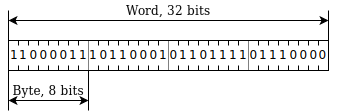
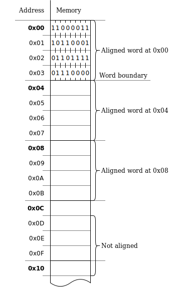
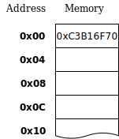
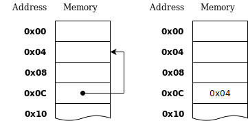
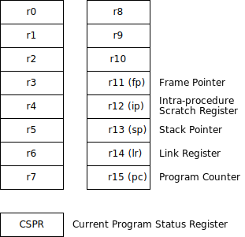
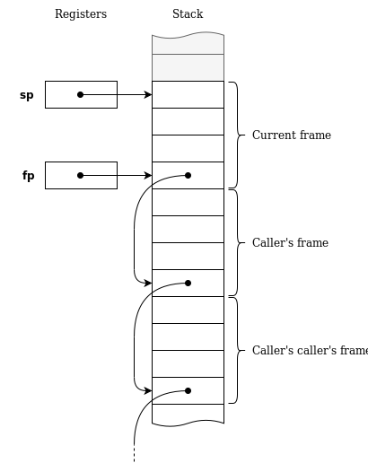

```{=html}
<h1>Compiling to Assembly<small><small><br/>from Scratch</small></small><br/></h1>
<center><p> — <a href='./#table-of-contents'>Table of Contents</a> — </p></center>
<span id="fold"> </span>
<h1><br/><small><small>Chapter 7</small></small><br/>ARM Assembly Programming<br/><br/></h1>
```

\chapter{ARM Assembly Programming}
\includegraphics{chapter-illustrations/7.png}
\newpage

By the end of this chapter, you will learn enough ARM assembly programming to implement the rest of the compiler.

We will be using the GNU Compiler Collection (GCC) toolchain,
most notably, the GNU Assembler (GAS).
See *Appendix B* for comparison between GAS and the legacy ARMASM syntax.

First, we'll take a bird's eye view of a simple hello-world program to get a taste of assembly programming.
After this rough initial overview, we will dive into details.

## A taste of assembly

This is not one of these *how to draw an owl* tutorials.
I will assume that you have never done any assembly programming and walk your way through it.
However, in the beginning, I wanted to start with a small, complete program to get a taste of assembly programming.
After that, we'll cover each part in detail.

So here it is, our first assembly program:

```js
/* Hello-world program.
   Print "Hello, assembly!" and exit with code 42. */

.data
  hello:
    .string "Hello, assembly!"

.text
  .global main
  main:
    push {ip, lr}

    ldr r0, =hello
    bl printf

    mov r0, #41
    add r0, r0, #1  // Increment

    pop {ip, lr}
    bx lr
```

This program prints `Hello, assembly!` to the console and exits with error code `42`.

Now, let's discuss this piece of assembly code step-by-step.

```js
.data
  hello:
    .string "Hello, assembly!"
```

The program starts with a `.data` directive. Under this directive, there are definitions of our global data, potentially mutable (or read-write).
There we have only one definition, a byte string defined with a `.string` directive.
It has a *label* named `hello:` which stands for the memory address of this string, which we can refer to.
The data section ends, and the `.text` directive starts the *code* section.

```js
.text
  .global main
  main:
    push {ip, lr}
```

This section is for immutable (read, no-write) data.
It is used for constants, as well as for the actual assembly instructions.
The only definition in the `.text` section is a function called `main` defined with the label `main:`.
It is declared "public" using the `.global` directive.
The function starts with an instruction `push` that saves some necessary registers on the stack.
Then, it continues below.

```js
    ldr r0, =hello
    bl printf
```

The function loads the address of the string that we defined earlier, by referring to the `hello` label.
The instruction `ldr` *loads* the address into *register* `r0`.
The instruction `bl printf` is the *call* instruction that calls the `printf` function to print the string.
The register `r0` is used to pass a parameter to `printf`.

```js
    mov r0, #41
    add r0, r0, #1
```

Next, we set up the exit code.
First, we use the `mov` instruction to *move*, or copy a number `41` into register `r0`.
Then the `add` instruction increments `r0` by one, resulting in `42`.
There's nothing special about the exit code `42`, and we didn't have to compute it from `41`.
But this taste of assembly would be incomplete without showing some basic instructions like `mov` and `add`.

```js
    pop {ip, lr}
    bx lr
```

The `main` function ends with a return sequence.
The registers that we saved, in the beginning, are now restored with the `pop` instruction, and then we return from the function with the `bx lr` instruction, assuming that the return value is in `r0`, which should be `42`.

As you probably noticed, the familiar single- and multi-line comments are supported.

## Running an assembly program

Here's how you get this simple program running.

> **Note**
>
> The instructions below assume that you are running the commands on an ARM-based computer (like a Raspberry Pi) with a 32-bit operating system.
> If this is not the case for you, check out *Appendix A* on how to adapt these instructions to other environments.

Save the previous program into a file called `hello.s` using a text editor.
Then type the following command into the console:

```sh
$ gcc hello.s -o hello
```

This will instruct GCC to assemble and link our program producing a `hello` executable.
By default, GCC will link our assembly with a `libc` library, which provides us with basic functions such as `printf` that we used here.

You see, the operating system kernel doesn't provide such functions directly.
For example, printing to the console is implemented in libraries like `libc` on top of (operating) *system calls* like `writev`.
Without these basics, we would be stuck without even being able to print to the console.

<!-- However, in *Part II*, we will have a quick overview of how to make *system calls* directly. *-->

Now, you can run the resulting executable as usual:

```sh
$ ./hello
Hello, assembly!
```

*Oh, hello there!*

\newpage

We can check the exit code by printing the `$?` shell variable.

```sh
$ echo $?
42
```

Now that we have a template to run our programs and a rough overview, we will dive deep into the details.

We will start with the basic data structure of assembly programming, the *machine word*, then followed by an overview of how memory and registers work, and finally proceed to cover the different kinds of instructions that manipulate registers and memory.

## Machine word

ARM is a 32-bit instruction set.
That means that most operations work with a 32-bit data structure called
the *machine word*.

In ARM, a word consists of 32 bits.
Each bit is binary `0` or `1`.

Another way to look at it, a word consists of *four* bytes, where each byte is 8 bits.

There are also half-words and double-words.
The names speak for themselves.
Operations on them are not as common.

Let's look at the following word.

<!--(Figure) |ñop| 11000011101100010110111101110000-->


What does it mean?
What does it stand for?
Well, the processor doesn't care.
It doesn't have a type system.
It doesn't have any information attached to words to help us distinguish what a word stands for in isolation.

If interpreted as an unsigned integer, this word could stand for `3_283_185_520`.
If interpreted as a signed integer, then it's `-1_011_781_776`.
It could be a byte array of four bytes, `[195, 177, 111, 112]`.
It could be an array of bits, where each bit is a single flag.
Or it could be a UTF-8–encoded string `"ñop"`, where `ñ` is encoded using as two bytes `195, 177`, while `o` and `p` are encoded as single-byte ASCII
characters with codes `111` and `112`.
It could also be an encoding of an ARM instruction with mnemonic `rsb`.
Or it could be an address pointing to some data location in memory.

<!-- More precisely, RSBVC FP, PC, R3, ASR #3 -->


It is up to us (programmers and compiler writers) to assign meaning to each word and to keep track of what they stand for.

> **Note**
>
> Throughout this book, we'll use (non-overlapping) solid boxes of different shapes and sizes to refer to 32-bit words.
> Like here, we'll use dashed lines to delimit individual bytes, where it adds clarity.

## Numeric notation

As we already did here, we'll use JavaScript notation to refer to different interpretations of data.
Modern JavaScript is quite good at that.
We could refer to the above word using binary *(base-2)* notation,
with `0b` prefix:

```js
0b11000011101100010110111101110000
```

JavaScript allows us to add underscores for readability; for example, to distinguish bit patterns of individual bytes:

```js
0b11000011_10110001_01101111_01110000
```

We can use good old decimal *(base-10)* notation:

```js
3_283_185_520
```

We can also use hexadecimal *(base-16)* notation, with `0x` prefix;

```js
0xC3_B1_6F_70
```

How do we decide which notation to use?
Why would we ever use hexadecimal?

Binary notation is straightforward: you can see the individual bits, and you can visually split a word into bytes, but it is very verbose!

Decimal notation is much terser, you get a good understanding of the magnitude of the number, but it is hard to reason about the values of individual bytes and bits.

Hexadecimal notation is terse, and it is easy to split a word into bytes visually.
Each hexadecimal digit maps to four bits, no matter the position in a number, so two hexadecimal digits always map to a byte.
All you need to remember is bit patterns of the 16 hexadecimal digits:

------------------------
 Hexadecimal    Binary
-------------- ---------
   `0x0`       `0b0000`

   `0x1`       `0b0001`

   `0x2`       `0b0010`

   `0x3`       `0b0011`

   `0x4`       `0b0100`

   `0x5`       `0b0101`

   `0x6`       `0b0110`

   `0x7`       `0b0111`

   `0x8`       `0b1000`

   `0x9`       `0b1001`

   `0xA`       `0b1010`

   `0xB`       `0b1011`

   `0xC`       `0b1100`

   `0xD`       `0b1101`

   `0xE`       `0b1110`

   `0xF`       `0b1111`

-------------- ---------

This way we can easily translate from hexadecimal to binary and back.
Take `0xC3_B1_6F_70`, as an example:

 * `0xC3` is `0b1100_0011`
 * `0xB1` is `0x1011_0001`
 * `0x6F` is `0b0110_1111`
 * `0x70` is `0b0111_0000`

Thus we can conclude that `0xC3_B1_6F_70` is the same as:

```js
0b11000011_10110001_01101111_01110000
```

Can't do this with decimal notation!

## Memory

Think of memory as a large continuous byte array.
It contains our program instructions encoded as binary words.
It contains the data that our program works with: data segment, code segment, stack, and heap (more on these later).

Like a byte array, you can access a single byte from memory given an index into this array.
We call this index, a *memory address*.
Memory addresses are 32-bit on ARM (how it all aligns, eh?).

However, not only can you access single bytes from memory, you can also access whole 32-bit words.
But there is a restriction: you can only access *aligned* words.
In this case, *aligned* means non-overlapping words or words which address is divisible by *four*.
One word contains four bytes, and each byte has its own address, but we address words only by the address of the first byte in the word.

> **Well, actually…**
>
> Newer ARM processors support unaligned access, but not for all relevant instructions, and it incurs a performance penalty.
> In this book, we avoid it.

In the following figure, you can see a stretch of memory starting from address `0x00` that shows how individual bytes and their addresses map to aligned words and their addresses.



From here on, we won't need this much detail when talking about memory, so we will use a simplified (but still as precise) word-level diagrams.
Like the next one that describes the same stretch of memory.



Sometimes we store a memory address in a memory word.
We call that a *pointer*.
In our diagrams, we will use arrows to show where a memory word is pointing.
We will omit the actual memory addresses in our diagrams since the exact value is not important.
The important part is where it points to, not the value itself.




As we already mentioned, the memory contains our data segment, code segment, stack, and heap.
However, what it does *not* contain (on most architectures, anyway) is *registers*.

## Registers

Registers are special memory words that are *outside* of the main memory.
They are used for intermediate values, sort of like temporary variables.
There's a limited number of these—usually 8, 16, or 32.

ARM has 16 main registers and a special *status* register (CPSR).
The main registers are called `r0` to `r15`, but some of them have alternative names.
See the next figure for more details.



First, why do we need registers?
Couldn't instructions work directly with memory?
They could, and there are other architectures such as accumulator-based and stack-based architectures that need only one register or no registers at all.
However, ARM is a *load-store* architecture.

With *load-store* architecture, the basic workflow is as follows:

* data is loaded from memory into registers, then
* operations are performed on registers, and finally
* the data is stored back into memory.

It turns out this workflow is quite efficient, and most modern architectures follow it.

Most ARM registers are general-purpose and can be used for any intermediate values.
We'll cover the more *special-purpose* registers like `fp`, `ip`, `sp`, `lr`, `pc`, and CPSR as we discover instructions that work with them.

* * *

You may have heard that *registers are fast*.
What does that even mean?
Why couldn't we use the same technology for memory?

Two reasons.

There are only 16 registers.
That means you can refer to a register using only 4 bits.
At the same time, memory addresses are 32-bit.
So you need fewer bytes (and instructions) to encode an operation on three registers, rather than an operation on three memory addresses.
And a processor can decode fewer instructions faster.

Second, computer memory has several *levels* of caches, usually referred to as *L1*–*L4*.
And even if the fastest cache uses the same technology as registers, there could still be a *cache miss*.
But such a cache miss can never happen in the case of registers.


## The add instruction

Let's get to our first instruction, `add`:

```js
add r1, r2, r3     /* r1 = r2 + r3; */
```

It consists of a mnemonic name `add` as well as three register *operands*, `r1`, `r2`, and `r3`.
In this case, *operand 1* is `r2`, *operand 2* is `r3`, and `r1` is the result, also called the *destination* operand.
This kind of instruction is called three-operand instruction.

As a comment, we provided a pseudo-code that describes the effect of the instruction.
Note that the order of operands in the instructions is the same as in the pseudo-code.
ARM assembly was designed such that this is always the case.

All ARM instructions are encoded into single 32-bit words in memory.
In this figure, you can see how this particular instruction is encoded into binary form.
We've left the meaning of some bits unexplained.


> **Well, actually…**
>
> Most ARM processors support several instruction sets.
> They have been historically called ARM, Thumb, and ARM64, but recently renamed to A32, T32, and A64.
>
> T32 (or Thumb 2), for example, is a variable-length instruction set
> with both 16-bit and 32-bit instructions.

## Immediate operand

The `add` instruction has a second form, where the *last* operand is a small number encoded directly into the instruction.
It is called an *immediate* operand, and the notation uses a `#` sign:

```js
add r1, r2, #64000     /* r1 = r2 + 64000; */
```

GNU Assembler allows familiar syntax for hexadecimal values with `0x` prefix and binary values with `0b` prefix.
However, it doesn't allow underscores in them.
So, the previous instruction can be rewritten as:

```js
add r1, r2, #0xFA00     /* r1 = r2 + 0xFA00; */
```

\newpage

In the following figure you can see how this instruction is encoded.


From the figure, you can see that there are 8 bits dedicated to the immediate operand, so you might conclude that it can represent any single byte value.
But—wait!—we've just used `64000` in our example, and that does not fit in a byte!
It turns out, there are four more bits in the instruction that encode how many *even* number of bits the immediate should be shifted.
This way we can represent
`0xFA`, or `0xFA0`, or `0xFA00`, or `0xFA000` and so on.

This is an ingenious way to encode a vast amount of interesting constants in a very tight space!

## Signed, unsigned, two's complement

What are we adding with the `add` instruction?
Unsigned integers? Signed integers?

It turns out that it works correctly both when all the operands are treated as unsigned integers, and in the case where they are all treated as signed integers.
This is thanks to the signed number representation that most computers use, called *two's complement*.
It was specifically designed for this trick: to use the same hardware adder for both signed and unsigned numbers.

> **Note**
>
> Even though `add` and most ARM instructions work on 32-bit words,
> in this section we'll show examples using signed and unsigned
> 8-bit bytes, to make them more manageable.

For example, if we try to add `0b1111_1100` and `0b0000_0010` using a hardware adder, we get `0b1111_1110`, which could be interpreted as an unsigned operation $252 + 2 ⇒ 254$, or as a signed operation $-4 + 2 ⇒ -2$.
In the following table, you can see how a range of binary patterns can be interpreted as an unsigned or a signed integer.

Table: Two's complement representation of integers

----------------------------------------------------------------------
  Bit pattern     Unsigned                   Signed\
                  interpretation             interpretation
-------------- ---------------------------- --------------------------
`0b0000_0000`                `0`                `0`

`0b0000_0001`                `1`                `1`

`0b0000_0010`                `2`                `2`

`0b0000_0011`                `3`                `3`

    $\vdots$             $\vdots$             $\vdots$

`0b0111_1100`              `124`              `124`

`0b0111_1101`              `125`              `125`

`0b0111_1110`              `126`              `126`

`0b0111_1111`              `127`              `127`

                                            *— signed
                                              overflow —*

`0b1000_0000`              `128`             `-128   `

`0b1000_0001`              `129`             `-127   `

`0b1000_0010`              `130`             `-126   `

`0b1000_0011`              `131`             `-125   `

     $\vdots$             $\vdots$            $\vdots$

`0b1111_1100`              `252`               `-4   `

`0b1111_1101`              `253`               `-3   `

`0b1111_1110`              `254`               `-2   `

`0b1111_1111`              `255`               `-1   `

                        *— unsigned
                           overflow —*

`0b0000_0000`                `0`                `0`

`0b0000_0001`                `1`                `1`

`0b0000_0010`                `2`                `2`

`0b0000_0011`                `3`                `3`

    $\vdots$               $\vdots$            $\vdots$
----------------------------------------------------------------------

Two's complement is an elegant system, but we won't go into its details here.


## Arithmetic and logic instructions

So, we have covered our first instruction.
Took a while, huh?
And I have good news for you!
All arithmetic and logic instructions in ARM have precisely the same three-operand form!

Here are just some of them:

--------------------------------------------------------------------------------------------------------
 Instruction                                      Mnemonic               Effect                         
---------------------------------------- ---------------------------  ----------------------------------
`add  r1, r2, r3`                        Add                           `r1 = r2 + r3; `                 
                                                                                                        
`sub  r1, r2, r3`                        Subtract                      `r1 = r2 - r3; `                 
                                                                                                        
`mul  r1, r2, r3`                        Multiply                      `r1 = r2 * r3; `                 
                                                                                                        
`sdiv r1, r2, r3`                        Signed divide                 `r1 = r2 / r3; `                 
                                                                                                        
`udiv r1, r2, r3`                        Unsigned divide               `r1 = r2 / r3; `                 
                                                                                                        
`bic  r1, r2, r3`                        Bitwise clear                 `r1 = r2 & ~r3;`                 
                                                                                                        
`and  r1, r2, r3`                        And (bitwise)                 `r1 = r2 & r3; `                 
                                                                                                        
`orr  r1, r2, r3`                        Or (bitwise)                  `r1 = r2 | r3; `                 
                                                                                                        
`eor  r1, r2, r3`                        Exclusive or (bitwise)        `r1 = r2 ^ r3; `                 
--------------------------------------------------------------------------------------------------------

Neat, isn't it?
We have now basically covered a big chunk of the instruction set.
Let's move on.

> **Note**
> 
> Division is one of those operations that differs for signed and unsigned integers.  As JavaScript doesn't have proper support for unsigned integers, we can't express the difference easily with our pseudo-code notation. Also, some ARM versions do not have hardware support for `sdiv` and `udiv` instructions (primarily, constrained embedded systems). To use them, you will need to pass an assembler parameter to specify an architecture version that supports them, for example, `gcc -march=armv7ve`.

## Move instructions

Move instructions copy a word from one register to another, or from an immediate operand to a register.
An immediate operand has the same restrictions as before.
There's also a "move–not" instruction that does bitwise negation.


-------------------------------------------------------------------
 Instruction                   Mnemonic                     Effect
---------------------- ----------------------  --------------------
 `mov r1, r2`           Move                              `r1 = r2;`
 
 `mvn r1, r2`           Move-not                         `r1 = ~r2;`
-------------------------------------------------------------------

## Program counter

We know that each instruction is encoded into a word.
We also know that instructions are located in memory one after another.
How does execution go from one instruction to the next one?

For that, the *program counter* is used.
The program counter is the register `r15`, but more often, it is referred to by its alternative name: `pc`.
On some architectures, it is called the *instruction pointer*.
The program counter is a pointer that points to the currently executing instruction.
By manipulating `pc`, we can change which instruction is executing next.

> **Well, actually…**
>
> Because of instruction pipelining (which we won't cover here) program counter usually points two instructions ahead of the currently executing instruction.
> But, for the most part, we can safely ignore that.

<!-- Restructure this? First talk about auto-increment pc. -->

For example, if register `r0` contains some address that we want to *jump* to we can do that by moving that address into `pc` and the execution will continue from there:

```js
mov pc, r0        /* pc = r0; */
```

By *jump*, we mean that execution is transferred to a different instruction, not the next one.

It is worth highlighting that *every* instruction affects the program counter.
At the very least, each instruction increments program counter by four bytes (one word) so that execution can transfer to the next instruction.
(Otherwise, we would always be stuck executing the same instruction).
So the *effect* of each instruction that we listed so far requires `pc += 4;` to be prepended:

```js
add r1, r2, r3     /* pc += 4; r1 = r2 + r3; */
```

Here's a little snippet of assembly where we increment `r0` by one (at a time), but by adding to `pc` we jump over two instructions.

```js
/* This is not a recommended practice.    */
mov r0, #0       /* pc += 4; r0 = 0;      */
add r0, r0, #1   /* pc += 4; r0 = r0 + 1; */
add r0, r0, #1   /* pc += 4; r0 = r0 + 1; */
add pc, pc, #8   /* pc += 4; pc = pc + 8; */
add r0, r0, #1   /* …skipped…             */
add r0, r0, #1   /* …skipped…             */
add r0, r0, #1   /* pc += 4; r0 = r0 + 1; */
```

Here, we made all the changes in `pc` explicit.
Note that even though `add` typically increments `pc` by 4, this is overridden if the result is written to `pc`.

From here on, we will resume omitting `pc += 4;` in pseudo-code.

We can conclude that the program counter is the most special register of all.
By changing it, we change which instruction is executed in our program next.
So don't use it for storing some temporary values!

## Branch instruction

We could jump forward and backward in code by adding to and subtracting from the program counter, but it is very cumbersome.
<!--Every time we add an instruction to our program, the offset of all the following instructions addresses.-->
<!-- TODO "what does that mean" -->

We can use a little bit of help from the assembler.
The assembler allows us to insert textual *labels* that represent particular instruction addresses.
Then we can use them with *branch* instruction `b`, and the assembler will take care of calculating the offset that is necessary to apply to `pc` to land at the correct instruction.

This way, our previous snippet can be rewritten as:

```js
  mov r0, #0
  add r0, r0, #1
  add r0, r0, #1
  b myLabel        /* pc = myLabel; */
  add r0, r0, #1   /* …skipped… */
  add r0, r0, #1   /* …skipped… */
myLabel:
  add r0, r0, #1
```

Even though the `b` instruction jumps to an offset relative to `pc`, and not to an absolute address, it helps to think of labels as constants with absolute addresses stored in them.
And that is how we will use them in pseudo-code that describes the effect of each instruction:

```js
  b myLabel        /* pc = myLabel; */
```

## Branch and exchange

While the `b` instruction allows us to make a relative jump computed from a label, `bx`—or *branch and exchange*—allows us to jump to an address stored in a register:

```js
  bx r0       /* pc = r0; */
```

How is it different from `mov pc, r0`?
For our purpose, it is the same.
Some would say it's a bit more readable.

However, it also allows to *exchange* instruction sets from ARM to Thumb and back.
But we won't be dealing with that in this book.

## Branch and link

*Branch and link*, or `bl` is a relative jump just like `b`.
The only difference is that it saves the program counter's value into a particular register, `r14`, more often referred to as `lr`, or *link register*.

```js
  bl myLabel    /* lr = pc; pc = myLabel; */
```

What it effectively does is it *saves* the previous value of `pc` before overriding it (and thus, losing it).

We could achieve the same with the following two instructions:

```js
  mov lr, pc;
  b myLabel;
```

However, this is such a common operation that it deserved its own instruction.
It is common because it is used to implement function calls.

## Intra-procedure–call scratch register

<!-- XXX: seriously, start with "Note that"? -->
Note that, under the hood, the instructions that branch to a label (`b` and `bl`) encode a 24-bit immediate value for the relative jump.
That allows us to jump forward and backward within ±32 MB of code space.
But you don't have to deal with this limitation.
The linker will arrange a so-called *veneer*: jump to a special place within the ±32 MB limit and then load the full 32-bit address into `pc`, if a longer jump is necessary.

To do that, it will need to generate code that loads the full address into a temporary register.
For this to be predictable, a special register was designated for the role: the *intra-procedure–call scratch register*, referred to as `r12` or `ip`.
This is mostly relevant for procedure (in other words, function) calls since other jumps to a label are usually relatively short.
Why *intra*? Because it is used *between* the calls: after the call is made by the caller, but before the control switches to the callee function.
It is also referred to as a *scratch* register, meaning, a short-lived temporary.
We can still use this register for our temporary values; we just can't rely that the value will be preserved after a call is made.
So it is best-suited for short-lived temporary values.


## Function call basics

The thing special about function calls that distinguishes them from other kinds of control-flow jumps is that function calls *return back*.
When programming in a higher-level language, we don't think much about that, but at assembly level, we have to implement the whole *return back* thing ourselves.

The value that the `bl` instruction stores into `lr` is called the *return address*.
When the function finishes, it can jump to it to continue execution from where it was called.

Let's implement a very primitive function, `addFourtyTwo`, that takes a single parameter and adds `42` to it.
ARM calling convention (which will talk more about later) says that we should pass the first four arguments in registers `r0`–`r3` (if any), and provide a return value in `r0` (if any, again).
In our case, `addFourtyTwo` takes one parameter and returns one value so that we use `r0` for both.

\newpage

```js
  mov r0, #0         /* r0 = 0;                     */
  bl addFourtyTwo    /* lr = pc; pc = addFourtyTwo; */
  sub r0, r0, #3     /* r0 = r0 - 3;                */

addFourtyTwo:
  add r0, r0, #42    /* r0 = r0 + 42;               */
  bx lr              /* pc = lr;                    */
```

The *caller* that calls `addFourtyTwo` first sets register `r0` to `0`, then uses `bl` to jump to `addFourtyTwo`, which saves the return address into `lr`.
At the end of `addFourtyTwo`, it branches back, with `bx lr` and the caller continues (with subtracting `3`, in this case).

Another way to look at this is that we pass `lr` as a special parameter to each function, so the function knows where to return back.

> **Well, actually…**
>
> I cannot help myself but mention the words *continuation-passing style* here.
> We won't cover it, but it is a powerful compiler technique that makes passing the return address (or *continuation*) explicit early in the compiler pipeline.

## Link register

The link register `lr` or `r14` is only special in the sense that `bl` works with `lr` and only `lr`.
We could decide to use a different register for the return address,
say `r8` (with the `mov r8, pc; b myLabel` sequence that we mentioned before), but `bl` is so convenient that we'll be using only `lr` for that purpose.

I must admit that the name *link register* is not perfect.
It's called that because it creates a *link* that can be followed back to the callee.
On some other architectures (like RISC-V), this register is called the *return address*, or `ra`.

\newpage

## Conditional execution and the CPSR register

So far, all the instructions we've covered were executed *unconditionally*.
As long as `pc` could reach those instructions, they were executed.
However, sometimes we want *conditional execution*.
This is when we want to decide whether to execute an instruction or not depending on some *condition*.
This is done in two steps in ARM:

* A comparison instruction `cmp` compares two registers (or a register and an immediate), and saves the result of the comparison into the CPSR register.
* One or more instructions with a *condition code* reads the result of the comparison from CPSR and executes (or not), depending on the condition code.

CPSR stands for the *current program status register*.

Here's an example, where a bunch of `mov` instructions are executed depending on a condition:

```js
  cmp   r1, r2     /* cpsr = compare(r1, r2);    */
  moveq r1, #10    /* if (eq(cpsr)) { r1 = 10; } */
  mov   r2, #20    /* r2 = 20;                   */
  moval r3, #20    /* r3 = 20;                   */
  movne r4, #30    /* if (ne(cpsr)) { r4 = 30; } */
```

First, `cmp` instruction compares registers `r1` and `r2` and saves the result of the comparison into CPSR.
It set a few bits in CPSR, but it's not important for us which exact bits are set, so in the pseudo-code, we've hidden that inside an opaque `compare` function.

Next, we see a bunch of instructions starting with `mov`.
Those are: `moveq`, `moval`, `movne`.
They are not separate instructions from `mov`, but are just `mov` with a condition code suffix.
For example, `mov` with `eq` code executes if the last comparison made with `cmp` was equal; `mov` with `ne`—not equal, and so on.
The `al` code stands for *always*, and is the default so it can be skipped, and thus, `mov` and `moval` is *exactly* the same instruction.

In the following table, you can see a summary of some condition codes.
These are not all, but it's more than enough for our use case.

Table: Summary of select ARM condition codes

 Code    Operator   Description                Signed/Unsigned
------- ---------- -------------------------- -----------------
 `eq`   `==`        Equal                      Either
 `ne`   `!=`        Not equal                  Either
                          ` `
 `gt`   `> `        Greater than               Signed
 `ge`   `>=`        Greater than or equal      Signed
 `lt`   `< `        Less than                  Signed
 `le`   `<=`        Less than or equal         Signed
                          ` `
 `hi`   `> `        Greater than               Unsigned
 `hs`   `>=`        Greater than or equal      Unsigned
 `lo`   `< `        Less than                  Unsigned
 `ls`   `<=`        Less than or equal         Unsigned
                          ` `
 `al`   —           Always (default)           —


The beautiful thing about the ARM instruction set is that these condition codes can be added to almost any instruction!
Branch if equal? `beq`! Add if greater than? `addgt`!
Compare—*again!*—if not equal? `cmpne`!

That's one of the features that makes the ARM instruction set *orthogonal*: conditional execution is available regardless of the instruction type.

## Conditional branching

Combining branch instructions like `b` and condition codes gives us *conditional branching*.
Conditional branching is used to implement `if`/`else` statements and loops like `while` and `for`.

## Loader

How did our program get into memory?
An operating system program called *loader* copied our program from disk into memory, and then set the program counter so that our program started execution from `main`.

\newpage

> **Well, actually…**
>
> The real entry point is called `_start`, by convention, and it doesn't need to be a `.global`.
> But we linked our program with `libc`, and it defines its own `_start` entry point, which sets up things like program's command-line arguments and other machinery that is necessary for `libc` functions to work.
> In turn, it will call `main`, and that is why it needs to be declared `.global`.

If the loader is an operating system program, then how did the operating system get into memory?
That is done with the help of a program called *boot loader*.

> **Well, actually…**
>
> In embedded systems, the program is often stored in read-only memory that doesn't get erased on power-off, and when the system starts, the program counter starts executing from address 0.

## Data and code sections

Let's look again at the data and code sections of our hello-world program.

```js
.data
  hello:
    .string "Hello, assembly!"

.text
  .global main
  main:
    push {ip, lr}

    ldr r0, =hello
    …
```

The data section declared with `.data` assembly directive is a span of memory that you are allowed to:

* read,
* write,
* but not execute.

The code section declared (confusingly) with `.text` is another span of memory that you are allowed to:

* read,
* but not write, and
* execute.

Why do we need separate sections?
Why the restrictions on writing and executing?
The answer is many-fold.

First, it is a security feature of many operating systems to forbid data section from executing and forbid modifying the code section at run-time.
It makes it harder to inject malicious code by tricking the program to change its code, or to jump to an area that is not supposed to be executed.
It also helps with caching and with running multiple instances of the same program on different data.

Even simpler, in embedded systems, the code section will most often go into read-only memory, while the data section will be the main read-write memory.

## Segmentation fault

In our hello-world program, we don't modify the greeting string, do we?
Does that mean that we can put it under the `.text` section?
Yes; we can even omit the `.text` section, since it's implicit:

```js
hello:
  .string "Hello, assembly!"

.global main
main:
  push {ip, lr}

  ldr r0, =hello
  bl printf

  mov r0, #41
  add r0, r0, #1

  pop {ip, lr}
  bx lr
```

Try it out!

Oh, no! Our program crashes with a *segmentation fault*!
What happened?
What's a segmentation fault anyway?

It can happen when we try to write to a read-only *segment*.
But, in general, this term is applied to all kinds of *memory access violations*.

So what did we violate here?
Alignment!
Our string—`"Hello, assembly!"`—is 17 bytes long (including the implicit zero-terminator `\0`).
So it pushed our `main` function to a memory address that is not an aligned word.
We can pad the string with zeros, so it occupies 20 bytes (divisible by four):

```js
hello:
  .string "Hello, assembly!\0\0\0"
```

Or, we can use an assembly directive called `.balign` to align it at a four-byte (word) boundary:

```js
hello:
  .string "Hello, assembly!"
  .balign 4
```

> **Well, actually…**
>
> There's also an `.align` directive, but its exact meaning is inconsistent across architectures and assemblers.
> On the other hand, `.balign` always aligns at a boundary specified as a number of *bytes*.

## Data directives

One way to look at an assembly language: it is a way to encode binary data.
As we know, each ARM instruction is encoded into a single machine word.
However, the assembler has directives that allow us to encode literal data as well.

Two directives that we'll talk about are `.string` and `.word`, but there are more available.

We've already seen the string directive.
One notable feature of it is that it encodes a zero-terminated string. That is, the string is padded with a single zero byte: `\0`.

The `.word` directive allows us to insert a literal machine word into our binary using a numeric notation:

```js
fourtyTwo:
  .word 42
```

It's a good idea to put a label before a data directive so we can refer to it later, but it is not always necessary, as you'll see below.

What are data directives good for?
They can be used for constants or global variables in our program, but they are simply another encoding for binary data.
Consider the following program.

```js
.global main
main:
  .word 0xE3A0002A /* Same as `mov r0, #42` */
  bx lr
```

This is a short program that simply exits with code 42.
But here, instead of writing `mov r0, #42`, we wrote `.word 0xE3A0002A`, which encodes the same value, as the instruction.
As you might remember from instruction encoding, the last byte of an instruction encodes an immediate, which is `0x2A` in this case (`42` in decimal).

Writing instructions this way *is definitely a bad idea*, but it is a way for us to dispel the magic of what the assembler does for us.

## Loading data

Loading means copying data from memory into one or more registers.
We've already seen how to load data, given a label.
For example, load a string address and pass it to `printf` to be printed to the console.

```js
  ldr r0, =hello
  bl printf
```

Similarly, you can load an address of a word.
But this way, you only get the address of the word, and not the word itself.

Once we have loaded an address of a word, we can load the word itself.
For that we use another form of `ldr` instruction, with square brackets:

```js
  ldr r1, =myWord    /* r1 = myWord */
  ldr r0, [r1]       /* r0 = M[r1]  */
```

This assumes that we have a word with that label stored somewhere:

```js
myWord:
  .word 42
```

When we load an address into a register, we call it a *pointer*.
This pointer *references* another word, but it's not that word itself.
When we load the word that is referenced by that pointer, we say that we *dereference* a pointer.

In this example, when the two instructions execute, `r1` will contain some seemingly random number, which is the address corresponding to the label `myWord`, while `r0` will contain the loaded value itself, that is `42`.

In the listing, we used a new notation for our pseudo-code.
We used `M[r1]` to refer to the memory word located at the address found in `r1`.
Remember, how we said that memory is like a large array?
This notation is easy to remember because the square brackets in the instruction syntax (`[r1]`) match the square brackets of array notation (`M[r1]`).
This will always be the case.

However, loading a single word known ahead of time is not very interesting.
For that there's a shortcut:

```js
  ldr r1, =42    /* r1 = 42 */
```

Even better, if the constant that we are loading can fit into an immediate value, the assembler will translate this into:

```js
  mov r1, #42    /* r1 = 42 */
```

However, if it doesn't fit into an immediate, it will convert it into something roughly equivalent to our previous example:

```js
  ldr r1, =temporaryWord    /* r1 = temporaryWord; */
  ldr r1, [r1]              /* r1 = M[r1]; */
  …

temporaryWord:
  .word 42
```

This version of `ldr` instruction is called a *pseudo-instruction*, because, as we have just seen, it will be converted to one or more actual instructions by the assembler.

## Load with immediate offset

It is not necessary to have a label for each word to load it.
You can also load a word given an *offset* from another word.

For example, if we have several consequtive words:

```js
myArray:
  .word 42
  .word 44
  .word 46
```

(Which we can also write as follows:)

```js
myArray:
  .word 42, 44, 46
```

Then, we can load the third word using the following syntax:

```js
  ldr r1, =myArray       /* r1 = myArray;   */
  ldr r0, [r1, #8]       /* r0 = M[r1 + 8]; */
```

Here we loaded a word given an 8-byte (and thus, 2-word) offset.
As a result, we have loaded `46` into `r0`.

The offset can be positive or negative.
It can be an immediate (like in this case) or a register.
For example:

```js
  ldr r0, [r1, -r2]    /* r0 = M[r1 - r2]; */
```


## Storing data

Storing means copying data from one or more registers into memory.
In other words, we are modifying, or *mutating* memory.

As we already mentioned, it is not possible to store data into the read-only segment that we declare with the `.text` directive: this will lead to a segmentation fault.

However, we can store data into the `.data` segment, as well as into the stack and the heap (that we'll get into in a short while).

Store instructions use `str` mnemonic, and use the same syntax as `ldr` instruction.
Some examples (with `ldr` for comparison):

```js
  str r0, [r1]         /* M[r1] = r0; */
  ldr r0, [r1]         /* r0 = M[r1]; */
  
  str r0, [r1, #8]     /* M[r1 + 8] = r0; */
  ldr r0, [r1, #8]     /* r0 = M[r1 + 8]; */
  
  str r0, [r1, -r2]    /* M[r1 - r2] = r0; */
  ldr r0, [r1, -r2]    /* r0 = M[r1 - r2]; */
```

The square brackets always remind us which part stands for the address.

## Stack

<!--
Call stack is another segment of memory, not unlike the code segment and the data segment.
It is also pre-allocated for you by the operating system.
However, unlike the other segments it requires a certain discipline or convention to follow.
It is used for storing temporary values: function parameters, local variables, values of intermediate expressions, but also for function return addresses.
-->
The *stack*, or the *call stack*, is used to implement nested, potentially recursive function calls.
It is a segment of memory, not unlike the code segment and the data segment.

In computing, a *stack* usually refers to a particular data structure.
The word *stack* is used as a metaphor for stacks of things, like books.
If you have a stack of books, it is easy to add one or few books at the top, and it is easy to remove one or few books at the top.
However, it is trickier to add or remove books in the middle or at the bottom of the stack.
A *stack* is a data structure that makes it easy (and efficient) to add and remove items from one end.

In JavaScript you rarely see anyone defining such data structure.
This is because the built-in `Array` is good enough as a stack: it has a `push` method to add a last element, and a `pop` method to remove it, and they are reasonably efficient.

The *call stack* is not a data structure in the sense of `Array`.
It is a segment of memory.
However, unlike those other segments, it requires us to follow a particular discipline or convention to use it.
This convention is called the *calling convention*.
It is defined so that functions written in different languages, or using different compilers can call each other and interoperate on some basic level.

For example, when we call some `libc` functions like `printf`, we need to follow this convention.
If we want other functions to call a function we've defined (as in the case of `main`), we also need to follow it.

First, we will look at the basic stack operations: push and pop, and then we will discuss the calling conventions, and how it can be implemented using these operations.

## Push and pop

The *stack pointer* is the central concept of the call stack.
In ARM assembly, it is referred to as `r13` or, more often as `sp`.
It holds the address of the *top of the stack*.
As the stack pointer changes its value, we say that the stack grows or shrinks.
The stack grows towards smaller addresses of the memory, and shrinks towards larger addresses.
We say that a word is allocated on the stack if it is pointed by the stack pointer, or below.

The following instruction pushes four words onto the stack.

```js
  push {r0, r1, r2, r3}
```

In the next figure, you can see several registers and a stretch of memory belonging to the call stack, shown in two states.
On the left, you can see the state before executing the push instruction, and on the right, you can see the state after executing it.


The effect is that the words are copied from registers to the stack, and the stack pointer is *decremented* by 16 bytes, and thus, four words.
It is *decremented* because it grows towards lower addresses.
The area above the stack pointer is greyed out to signify that this area is not allocated.

We could have acheived the same effect using the following instructions:

```js
  sub sp, sp, #16
  str r0, [sp, #0]
  str r1, [sp, #4]
  str r2, [sp, #8]
  str r3, [sp, #12]
```

Or the following sequence of individual `push` instructions:

```js
  push {r3}
  push {r2}
  push {r1}
  push {r0}
```

The `push` instruction has a counterpart, `pop`:

```js
  pop {r0, r1, r2, r3}
```

This reverses the previous action: *increments* `sp` by 16, and copies values from stack into registers.
It does this in the reverse order, in other words, like this:

```js
  pop {r0}
  pop {r1}
  pop {r2}
  pop {r3}
```

These instructions use curly braces that remind us of the set notation.
This is to signify that the order in which you write them in the assembly does not matter.

You can write it either way:

```js
  push {r3, r1, r2, r0}  // push {r0, r1, r2, r3}
```

But the effect will be the same:

 * Lower registers (think `r0`) are pushed to and popped from the lower memory addresses.
 * Higher registers (think `r15`) are pushed to and popped from the higher memory addresses.

The `push` and `pop` instructions' encodings have 16 bit-flags dedicated to the 16 registers.
So they can express which registers to push or pop, but not their order.
The order was picked so that a pop operation would undo the effect of the corresponding push operation.

<!-- Figure showing an encoding? -->

## Stack alignment

An essential peculiarity of the call stack is that the stack pointer should be aligned at the 8-byte (2-word) boundary at so-called *external interfaces*.
In this book, we won't discuss what this means and will just mention that calling a `libc` function is one of those cases.
Our compiler will not distinguish between calling a `libc` foreign function from a baseline language function.
For simplicity, we will assume an even stricter requirement that *the stack pointer should always be 8-byte (2-word) aligned*.

So, what if we need to push a single word onto the stack?
If we just do `push {r4}`, then our stack won't be aligned.
Thus, it is common to push some other register as a dummy to maintain the stack alignment when needed:

```js
  push {r4, ip}
```

Here we used the `ip` registers for that purpose.
The same as we did when we defined our `main` function:

```js
.global main
main:
  push {ip, lr}
  …
```

In general, we can always pad a push with a dummy register to maintain the stack alignment.
When constructing the compiler, we will also talk about how we can maintain the stack alignment without wasting space unnecessarily.


## Arguments and return value

<!-- Joshua: Can you give me a hint about supporting more than 4 arguments? -->

Function arguments are passed in the first four registers: `r0`–`r3`.
The rules are elaborate regarding differently-sized arguments, but in our compiler, all values are represented using a single word.
Thus, we can say that the first four arguments are passed in the registers `r0`–`r3`.
These registers are also sometimes called the *argument registers*.

The rest of the arguments are passed by pushing them onto the stack.

For example, if a function `f` takes six parameters, to make a call `f(10, 20, 30, 40, 50, 60)` we need to write the following assembly:

```js
  mov r0, #50
  mov r1, #60
  push {r0, r1}   // 50 and 60 go on stack
  mov r0, #10     // 10, 20, 30, 40 go in registers
  mov r1, #20
  mov r2, #30
  mov r3, #40
  bl f            // The actual call
  add sp, sp, #8  // Deallocate 2 words of stack
```

It is also the caller's responsibility to deallocate the stack space used for the arguments that didn't fit into the four argument registers.
After a function returns, the return value (if any) is expected to be in `r0`.
(It can also span `r0`–`r1` in case of a 64-bit return value.)

It is expected that the assembly programmer or the compiler writer knows (from external sources) about the correct signature of each function: the number of parameters, their size, and about the return value (if any).
For a `libc` function, we can look them up in the documentation, and for a function defined in our language, we can see it from its definition.

## Register conventions

After a call returns, the contents of registers `r0`–`r3` will be unpredictable and semi-random and should not be relied upon.
(This is, of course, except for the registers that are used for the return value, if any.)
In other words, these registers will contain *garbage* that is left over after the function call: the called function itself might have used them or called another function.
That's why we say that the registers `r0`–`r3` are *call-clobbered*.
Another register that is a *call-clobbered* register is `r14` or `lr`.
It is clobbered by the design of the "call" instruction `bl`, which overwrites the `lr` with the return address.
Another *call-clobbered* register is `r12` or `ip`, which is clobbered by the linker-generated veneer. <!-- explain? -->

In contrast, all other registers are *call-preserved*.
In other words, it is the responsibility of each function to preserve the values in these registers when a call returns.
Can a function modify them at all?
Yes, but it should make sure to restore the values before returning from the call.

If *call-clobbered* registers are a good fit for arguments, then *call-preserved* registers are a good fit for variables.
The registers `r4` to `r10` are sometimes referred to as *variable registers*.
Other *call-preserved* registers are: frame pointer and stack pointer (`r11` or `fp` and `r13` or `sp`).
(We'll get to the frame pointer in a minute.)
In other words, it is expected that the top of the stack will be at the same address as before the call.
The program counter register (`r15` or `pc`) is a special register, but you can think of it as being call-preserved too: when the call returns back, the `pc` is restored to the previous value.

Table: ARM register roles and conventions

----------------------------------------------------------------------
Register      Role                                  Convention
------------- ------------------------------------- ------------------
`r0`           Argument/return
               register                             *Call-clobbered*

`r1`           Argument register                    *Call-clobbered*

`r2`           Argument register                    *Call-clobbered*

`r3`           Argument register                    *Call-clobbered*

`r4`           Variable register                    *Call-preserved*

`r5`           Variable register                    *Call-preserved*

`r6`           Variable register                    *Call-preserved*

`r7`           Variable register                    *Call-preserved*

`r8`           Variable register                    *Call-preserved*

`r9`           Variable register                    *Call-preserved*

`r10`          Variable register                    *Call-preserved*

`r11` or `fp`  Frame pointer                        *Call-preserved*

`r12` or `ip`  Intra-procedure
               scratch register                     *Call-clobbered*

`r13` or `sp`  Stack pointer                        *Call-preserved*

`r14` or `lr`  Link register                        *Call-clobbered*

`r15` or `pc`  Program counter                      *Call-preserved*
----------------------------------------------------------------

So, how do we preserve the values of the call-preserved registers, in practice?
When the call starts, we decide which call-preserved registers we want to use, so we push them onto the stack.
Then we proceed with using them to our liking.
Then we pop them off the stack before returning the call.
It is also said that we are *saving* these registers on the stack.

Thus, the terms *call-clobbered* and *call-preserved* have an alternative terminology: *callee-saved* and *caller-saved*.
This refers to which side of the call is responsible for saving the registers onto the stack, *if they want them to be preserved*.
So that's another way to look at it.

## Frame pointer

The last register that we haven't talked about is the *frame pointer* denoted as `r11` or `fp` in assembly.
A function's *frame* is an area of the stack which is allocated by that function.
It is also referred to as a *stack frame*, a *call frame*, or an *activation record*.
When it is used, the *frame pointer* is set to point to the *base* of the frame, in other words, to an address where the stack pointer used to point when the function was called.
The area of the stack between the stack pointer and the frame pointer is the current function's stack frame.
The frame pointer is a call-preserved register.
By convention, we save the frame pointer in the same stack slot where the new frame pointer points.
This way, the frame pointer register gives a start to a *linked list* of stack frames, where intermediate links are the stack-saved frame pointers of the callers.
See the diagram that follows.



Unlike in the diagram, each stack frame usually has a different size, depending on the number of local variables and intermediate values.

It is optional to use the frame pointer register this way, and it is optional to maintain the linked list of stack frames.
However, it is used by debuggers, introspection tools, and it may be necessary for certain language features, such as exception handling and non-local go-to statements.
Since the frame pointer doesn't change after the function is called, it is a convenient pointer to use when loading data from the stack frame, such as local variables.
You know that `fp + 4` always refers to the same stack slot, where a variable can be stored.
At the same time, loading local variables relative to the stack pointer is a bit trickier: stack pointer often changes its value, but it is certainly possible.

<!--
Removed this, I don't think we deliver on the part 2 promise here:

 The baseline compiler will use the frame pointer, but in *Part II*, we will talk about how we can get away without a frame pointer, and thus free up another variable registers. -->

<!-- TODO: talk about not using the frame pointer in Part II -->

## Function definitions

We have already defined some functions previously, `main` and `addFourtyTwo`.
The latter looks pretty simple:

```js
addFourtyTwo:
  add r0, r0, #42
  bx lr
```

Calling this function doesn't allocate any stack at all!
Neither for intermediate values, nor for saving registers.
The return address is passed in the `lr` registers.
And it doesn't need to save any registers, because it doesn't use any call-preserved registers.

This all changes as soon as you want to define a function that calls another function, like the `main` function, that we have seen before:

```js
.global main
main:
  push {ip, lr}
  ldr r0, =hello
  bl printf
  mov r0, #41
  add r0, r0, #1
  pop {ip, lr}
  bx lr
```

Since it calls `printf`, this call will potentially clobber all the call-clobbered registers, notably: the return address `lr`.
If we want to be able to return from `main`, we better save this register onto the stack.
And that's exactly what we did in our `main` definition by doing `push {ip, lr}`.
We have also saved a dummy `ip` register to maintain stack-alignment.

Now, if we wanted to maintain the frame pointer and the linked-list of frames, we would do things differently.
We would push both `lr` and `fp` onto the stack and then set the new frame pointer to match the stack pointer.
Now we can push and pop the stack, and we will still have a solid frame of reference in `fp` for accessing local variables.
Using the `fp` also makes it easy to deallocate the frame.
You can do it with `mov sp, fp` at the end of your function.
Alternatively, you could try to match all the pushes and pops, but it can be tricky.
All this busywork has a name, or two in fact: function's *prologue* and *epilogue*.

```js
.global main
main:
  push {fp, lr}  // Function's
  mov fp, sp     // prologue
  …
  mov sp, fp     // Function's
  pop {ip, lr}   // epilogue
  bx lr          //
```

Function's prologue saves the call-preserved registers, sets up the frame pointer, if necessary.
Function's epilogue reverses this and exits the function.

In this epilogue, we `pop` the registers back, and return using `bx lr`.
If you remember, in this case, `bx lr` is the same as `mov pc, lr`.
So, why not pop the return address directly into `pc`, instead of `lr`?
This way, we can make our epilogue shorter and more efficient:

```js
  mov sp, fp     // Function's
  pop {ip, pc}   // epilogue
```

This is a common way to organize a function's prologue and epilogue in ARM.


## Heap

The other memory segment is called the *heap* or the *dynamic memory*.
It is dynamic in the sense that a program can ask the operating system to allocate or deallocate a new region of memory at runtime.
This is usually done by calling the `libc` functions (`malloc` and `free`), which eventually make the system calls for you.
The function `malloc` takes a single argument in `r0` that specifies how many bytes we want to allocate.
It returns a pointer in `r0`, which points to the newly allocated region of memory.
The function `free` takes such pointer as its single parameter in `r0` and deallocates that region of memory.
After that, you can't use this region, and the operating system will use that memory somewhere else.

Here's a small snippet of assembly which allocates a single word on the heap, stores the number `42` into it, and then deallocates it.

\newpage 

```js
.global main
main:
  push {ip, lr}     // Prologue

  mov r0, #4        // Allocate four
  bl malloc         // bytes (one word)

  mov r3, #42       // Store 42 into
  str r3, [r0, #0]  // that word

  bl free           // Free/deallocate

  pop {ip, pc}      // Epilogue
```

It is common for high-level languages to allocate most of the objects and data structures on the heap,
and the functions are only passing and returning pointers to these objects.

* * *

There's much more to discuss about ARM assembly and assembly programming, in general.
But this chapter should be enough to get a solid grasp on it.
And even more than enough to complete the second pass of our compiler.


```{=html}
<center><a href="./08-second-pass-code-generation#fold">Next: Chapter 8. Second Pass: Code Generation</a></center>
```
