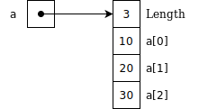
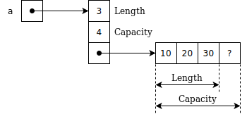

```{=html}
<h1>Compiling to Assembly<small><small><br/>from Scratch</small></small><br/></h1>
<center><p> — <a href='./#table-of-contents'>Table of Contents</a> — </p></center>
<span id="fold"> </span>
<h1><br/><small><small>Chapter 11</small></small><br/>Arrays and Heap Allocation<br/><br/></h1>
```

\chapter{Arrays and Heap Allocation}
\includegraphics{chapter-illustrations/11.png}
\newpage

Let's implement simple arrays that can be created using literal notation: `[10, 20, 30]`.
We want to be able to extract elements by indexing into an array (`a[0]`), and to query for array's length (`length(a)`).

<!--Let's implement simple arrays, which can be created using literal notation like `[10, 20, 30]`, extract an element by indexing (`a[0]`) and querying for their length (`length(a)`).-->

```js
let a = [10, 20, 30];
assert(a[0] == 10);
assert(a[1] == 20);
assert(a[2] == 30);
assert(a[3] == undefined);  // Bounds checking
assert(length(a) == 3);
```

We would also like to implements bounds checking.
In other words, if we ask for an index that is out of bounds, we don't want a segmentation fault.
In this case, in JavaScript, we expect `undefined`{.js} to be returned.
In other languages, it could be `null`{.js} or an exception can be raised.
We ignore the fact that `undefined`{.js} is nothing but a glorified `0` until later.

To cover this functionality, we need three new AST nodes, listed in the following table.

+---------------------------------------------------------------+--------------------------+
| AST Constructor Signature                                     | Example                  |
+===============================================================+==========================+
|                                                               |                          |
| `ArrayLiteral(args: Array<AST>)`                              | `[a1, a2, a3]`           |
|                                                               |                          |
| `ArrayLookup(array: AST, index: AST)`                         | `array[index]`           |
|                                                               |                          |
| `Length(array: AST)`                                          | `length(array)`          |
|                                                               |                          |
+---------------------------------------------------------------+--------------------------+

Table: Summary of AST constructor signatures with examples

We have picked the name `ArrayLiteral` as opposed to `Array` in order not to clash with JavaScript built-in `Array` class that we already use a lot in the implementation.
We decided to use a `length` function as opposed to a method (like in JavaScript) since we don't have support for methods yet.
However, we could have a special syntax for `x.length` just for this purpose.

We add two new tokens: `LEFT_BRACKET` and `RIGHT_BRACKET` standing for "`[`" and "`]`".
We also extend our grammar (and parser) with two new rules that we integrate into the `atom` rule.

\newpage

```js
arrayLiteral <- LEFT_BRACKET args RIGHT_BRACKET

arrayLookup <- ID LEFT_BRACKET expression RIGHT_BRACKET

atom <- call / arrayLiteral / arrayLookup / scalar
      / LEFT_PAREN expression RIGHT_PAREN
```

There are several ways to lay out an array in memory.
The simplest is the layout of a fixed-size array.
Such array is represented as a pointer to a single stretch of memory containing array length and the elements.
In the following figure, you can see such array layout for an example array `[10, 20, 30]`.



However, fixed-size arrays are, well, fixed-size.
To implement growable or resizable arrays, we need a more sophisticated layout, like the one in the following figure.
It stores array length and its *capacity*, as well as a pointer to the actual array of elements.
The idea is to *over-allocate* array to some extent, such that the capacity is larger than the length.
This way, elements could be added to the array without memory allocation (to some extent).
When an array grows beyond capacity, a new span of memory is allocated for the elements.



Let's look at code generation for fixed-size arrays.

## Array literals

We start with code generation for array literals.

```js
class ArrayLiteral implements AST {
  constructor(elements: Array<AST>) {}

  emit(env: Environment) {
    let length = this.elements.length;
    emit(`  ldr r0, =${4 * (length + 1)}`);
    emit(`  bl malloc`);
    emit(`  push {r4, ip}`);
    emit(`  mov r4, r0`);
    emit(`  ldr r0, =${length}`);
    emit(`  str r0, [r4]`);
    this.elements.forEach((element, i) => {
      element.emit(env);
      emit(`  str r0, [r4, #${4 * (i + 1)}]`);
    });
    emit(`  mov r0, r4`);
    emit(`  pop {r4, ip}`);
  }

  equals(other: AST): boolean {…}
}
```

First, we call `malloc` to allocate enough memory to store the length of the array and the elements.
Since `malloc` takes the number of *bytes* to be allocated we need to multiply the length by four and add one more word to store the length itself.

\newpage

```js
    let length = this.elements.length;
    emit(`  ldr r0, =${4 * (length + 1)}`);
    emit(`  bl malloc`);
```

Then, `malloc` returns a pointer to the freshly-allocated memory in `r0`.
However, `r0` is a lousy register for this.
As we emit code for each array element, `r0` will be clobbered.
Thus, let's use `r4` for this, which is a call-preserved register.
But before we do that we need to save the previous value of `r4` on the stack.

```js
    emit(`  push {r4, ip}`);
    emit(`  mov r4, r0`);
```

Next, we store array length in the first word of the allocated span of memory.

```js
    emit(`  ldr r0, =${length}`);
    emit(`  str r0, [r4]`);
```

After that, we emit code for each element and store it into the corresponding memory slot.

```js
    this.elements.forEach((element, i) => {
      element.emit(env);
      emit(`  str r0, [r4, #${4 * (i + 1)}]`);
    });
```

We finish by returning the pointer in `r0` and restoring the call-preserved `r4`.

```js
    emit(`  mov r0, r4`);
    emit(`  pop {r4, ip}`);
```

## Array lookup

Next is code generation for array lookup.

```js
class ArrayLookup implements AST {
  constructor(array: AST, index: AST) {}

  emit(env: Environment) {
    this.array.emit(env);
    emit(`  push {r0, ip}`);
    this.index.emit(env);
    emit(`  pop {r1, ip}`);
    emit(`  ldr r2, [r1]`);
    emit(`  cmp r0, r2`);
    emit(`  movhs r0, #0`);
    emit(`  addlo r1, r1, #4`);
    emit(`  lsllo r0, r0, #2`);
    emit(`  ldrlo r0, [r1, r0]`);
  }

  equals(others: AST) {…}
}
```


First, we store the array pointer in `r1` and array index in `r0`.

```js
    this.array.emit(env);
    emit(`  push {r0, ip}`);
    this.index.emit(env);
    emit(`  pop {r1, ip}`);
```

Then, we load array length into `r2` and compare it with the array index to perform bounds checking.
If array index is out of bounds, we do a conditional `mov` with `hs` suffix and return zero.
If it succeeds, then we execute three instructions with `lo` suffix.
In these three instructions, we convert array index into byte offset.
We add 4 to skip over the length slot, and we do *logical shift left* or `lsl` to convert from word offset to byte offset.
Shifting left by two is virtually the same as multiplying by 4.

```js
    emit(`  ldr r2, [r1]`);
    emit(`  cmp r0, r2`);
    emit(`  movhs r0, #0`);
    emit(`  addlo r1, r1, #4`);
    emit(`  lsllo r0, r0, #2`);
    emit(`  ldrlo r0, [r1, r0]`);
```

However, using some of the ARM assembly language features that we have not covered in the book (like auto-increment and barrel shifter) we can shortern the same code to this:

```js
    emit(`  ldr r2, [r1], #4`);
    emit(`  cmp r0, r2`);
    emit(`  movhs r0, #0`);
    emit(`  ldrlo r0, [r1, r0, lsl #2]`);
```

Which is an elegant way to do a bounds check and convert array index into a byte offset at the same time.

## Array length

Array length can be obtained by following the slot directly pointed by the array.

```js
class Length implements AST {
  constructor(array: AST) {}

  emit(env: Environment) {
    this.array.emit(env);
    emit(`  ldr r0, [r0, #0]`);
  }

  equals(others: AST) {…}
}
```

## Strings

Strings can be thought as arrays of bytes with a particular encoding.
They can be implemented similarly to arrays, but using byte variants of the load and store instructions, `ldrb` and `strb`, instead of the regular `ldr` and `str`.
However, when we see `a[i]` we need to know if it's an array or a string to execute the right code.
We either need to know the static type of the variable at compile time, or its dynamic type (or tag) by inspecting the data-structure at run time.
But before we jump into that, we need to learn about one particular pattern that will help us maintain our code better.

\newpage
\begin{center}\rule{0.5\linewidth}{0.5pt}\end{center}

```{=html}
<center><a href="./12-visitor-pattern#fold">Next: Chapter 12. Visitor Pattern</a></center>
```
