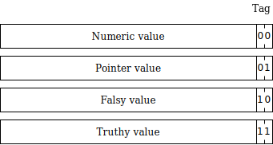

```{=html}
<header>
<h1><small><small>Chapter 14</small></small><br/>Dynamic Typing</h1>
<a href='./#table-of-contents'>Compiling to Assembly from Scratch</a>
<br/>by <a href='/'>Vladimir Keleshev</a>
</header>
```

\chapter{Dynamic Typing}
\includegraphics{chapter-illustrations/14.png}
\newpage


With dynamic typing, you expect to be able to query the data type of any variable, using `instanceof`{.js} or some other mechanism.
Right now we can't distinguish at run time between a number and (a pointer to) an array.
With the static type system we have, it doesn't matter, because such comparison is disallowed at run time.

So, how do we distinguish a pointer from a number, a false from zero, and so on?
This is typically achieved with *tagging*.

## Tagging

Tagging is reserving one or more bits in every word for a particular purpose, for example, to distinguish its type.

For our compiler, we will adopt a two-bit tagging scheme described in the following figure.



But how do we exactly "afford" these two bits?
Doesn't it change the actual numeric or pointer value?

Let's talk about pointers first.

## Pointer tag

We expect pointers to be word-aligned.
That means that the last two bits in a word will always be `0b00`.
That means we can store a two-bit tag there to distinguish pointers.

The simplest way to deal with that is to select the tag `0b00`.
And that's what many implementations do.
But we can also select a different tag, like `0b01`, as we did.
In the general case, when we want to operate on a pointer, we can remove the tag, do the operations, then put it back, if necessary.
However, having a tag of `0b01` simply means that we point to the second byte in the word.
So, to load the first word, instead of loading at offset `0`, we can load at offset `-1`.
This way `ldr r0, [r1]` becomes `ldr r0, [r1, #-1]`, and `ldr r0, [r1, #4]` becomes `ldr r0, [r1, #3]` and so on!
This means that not much is lost.
At worst, it takes one instruction to clear the tag.

The only kind of pointers we handle right now are array pointers.
To distinguish them from other heap-allocated objects, it is common to encode information about the object type in the data structure itself.

Next, let's talk about integers.

## Integer tag

If we dedicate two bits for tagging, that means that our integers shrink from 32-bit ones to 30-bit ones.
That's an oddly-sized integer!
However, in dynamically-typed languages, integers are often silently promoted to floating-point numbers or arbitrary-precision numbers.
That means the fact that an integer is 30-bit is not exposed to the user of the language.
These oddly-sized integers are called *small integers*.

So, of course, to deal with small integers we can remove the tags, perform an operation and then add the tag.
However, that's not always necessary either.
We have selected the tag `0b00` for integers.
That means that most arithmetic and logic operations will work on such tagged integers as-is.
For example, `3 + 4 = 7` used to be `0b11 + 0b100 = 0b111`, but now it's `0b11_00 + 0b100_00 = 0b111_00`.
(We have used underscores to separate the tag and the value visually.)
One notable exception to this is multiplication, which requires one instruction—shift right—to fix it up, and even then there are ways to incorporate that shift "for free" as a part of another instruction.

By selecting this tag, we can achieve decent performance and avoid changing our code generation pass too much.

## Truthy and falsy tags

We have two more tags available: `0b10` and `0b11`.
And we use them for all the falsy and truthy values, correspondingly.
This is to highlight the fact that tags are often selected in creative ways to simplify common operations.
We only have `true`{.js}, `false`{.js}, and `undefined`{.js} left in our language.
We will assign them values `0b1_11`, `0b1_10`, and `0b0_10`, correspondingly.
This also allows us to quickly check if a value is boolean by checking that the bits `0b1_10` are set.

## Code generation

Now, we will modify our code generation pass to adapt to our new tagging strategy.
But first, let's introduce some useful constants.
We start with the four tags:

```js
let numberTag = 0b00;
let pointerTag = 0b01;
let falsyTag = 0b10;
let truthyTag = 0b11;
```

Then the bit patterns of our literal values `true`{.js}, `false`{.js}, and `undefined`{.js}:

```js
let trueBitPattern = 0b111;
let falseBitPattern = 0b110;
let undefinedBitPattern = 0b010;
```

And a helper function to convert an integer to a small integer (in other words, to add a tag to an integer):

```js
let toSmallInteger = (n: number) => n << 2;
```

And finally, a bitmask that will help us extract the tag from a word:

```js
let tagBitMask = 0b11;
```

Now, onto the code generation pass.

## Literals

Generating an integer number now uses the `toSmallInteger` helper:

```js
  visitNumber(node: Number) {
    emit(`  ldr r0, =${toSmallInteger(node.value)}`);
  }
```

Boolean and undefined values use the defined constants:

```js
  visitBoolean(node: Boolean) {
    if (node.value) {
      emit(`  mov r0, #${trueBitPattern}`);
    } else {
      emit(`  mov r0, #${falseBitPattern}`);
    }
  }
  
  visitUndefined(node: Undefined) {
    emit(`  mov r0, #${undefinedBitPattern}`);
  }
```

## Operators

Previously, the type system enforced that the operators are used with the right data types.
For example, the addition was only allowed on numbers.
Now, we need to define addition so that it works (to some extent) with any types.
For instance, JavaScript has complicated coercion rules.
If you add an empty array `[]` and a number `1` the result is a string `"1"`.
For our compiler, we'll adopt simplified coercion rules.
If the two operands are numbers, the result is a number, otherwise—`undefined`{.js}.

Using addition as our example, we can implement such operators like this:

```js
  visitAdd(node: Add) {
    node.left.visit(this);
    emit(`  push {r0, ip}`);
    node.right.visit(this);
    emit(`  pop {r1, ip}`);

    // Are both small integers?
    emit(`  orr r2, r0, r1`);
    emit(`  and r2, r2, #${tagBitMask}`);
    emit(`  cmp r2, #0`);

    emit(`  addeq r0, r1, r0`);
    emit(`  movne r0, #${undefinedBitPattern}`);
  }
```

To implement the negation operator, we need to handle truthiness and falseness for the first time.
With our tagging system, a word is falsy if it is zero, or ends with a falsy tag `0b10`.
That's why we need to perform two comparisons.

```js
  visitNot(node: Not) {
    node.term.visit(this);

    // Is falsy?
    emit(`  cmp r0, #0`);
    emit(`  andne r0, r0, #${tagBitMask}`)
    emit(`  cmpne r0, #${falsyTag}`);

    emit(`  moveq r0, #${trueBitPattern}`);
    emit(`  movne r0, #${falseBitPattern}`);
  }
```

We will need to do the falsy check in more places, so let's extract it into a helper method:

```js
  emitCompareFalsy() {
    emit(`  cmp r0, #0`);
    emit(`  andne r0, r0, #${tagBitMask}`)
    emit(`  cmpne r0, #${falsyTag}`);
  }
```

Conditionals in `If` and `While` nodes will need to use `emitCompareFalsy` in palce of `cmp r0, #0` too.


## Arrays

Array literals are mostly as before, with two exceptions.
First, the length is now stored as a small integer.
Second, a pointer tag is added as follows.
Previously, `mov r0, r4` moved our call-preserved pointer to the return register `r0`.
Now, we accomplish the same and add a `0b01` tag at the same time using `add r0, r4, #1`.
We can do this because `malloc` will only return us word-aligned pointers with last two bits being `0b00`.

```js
  visitArrayLiteral(node: ArrayLiteral) {
    emit(`  ldr r0, =${4 * (node.args.length + 1)}`);
    emit(`  bl malloc`);
    emit(`  push {r4, ip}`);
    emit(`  mov r4, r0`);
    emit(`  ldr r0, =${toSmallInteger(node.args.length)}`);
    emit(`  str r0, [r4]`);
    node.args.forEach((arg, i) => {
      arg.visit(this);
      emit(`  str r0, [r4, #${4 * (i + 1)}]`);
    });
    emit(`  add r0, r4, #1`);  // Move to r0 and add tag
    emit(`  pop {r4, ip}`);
  }
```

Array length primitive is almost the same as before, except that we load with a `-1` offset to cancel the tag out.

```js
  visitLength(node: Length) {
    node.array.visit(this);
    emit(`  ldr r0, [r0, #-1]`);
  }
```

For array lookup, we don't use any tricks to remove the overhead of tagging and simply issue an additional instruction to remove the tag before the lookup.
Also, we return `undefined`{.js} instead of zero if bounds checking fails.

```js
  visitArrayLookup(node: ArrayLookup) {
    node.array.visit(this);
    emit(`  bic r0, r0, #${pointerTag}`); // Remove tag
    emit(`  push {r0, ip}`);
    node.index.visit(this);
    emit(`  pop {r1, ip}`);
    emit(`  ldr r2, [r1], #4`);
    emit(`  cmp r0, r2`);
    emit(`  movhs r0, #${undefinedBitPattern}`);
    emit(`  ldrlo r0, [r1, r0]`);
  }
```
<!-- print layout
    emit(`  pop {r1, ip}`);
    // r0 => index, r1 => array, r2 => array length
--->

Notice an interesting coincidence.
Since we now store array length as a small integer, we don't need to shift left to convert array length to byte offset.
Small integers are already shifted left by two thanks for the `0b00` tag.

* * *

Code generation for the `Function` node needs a small adjustment: it needs to return `undefined`{.js} instead of zero when a function ends with no return statement.
The rest of the nodes (`Call`, `Return`, `Id`, `Assign`, `Var`, `Block`) do not require changes in code generation to adapt to dynamic typing.

With type checking turned on, our existing test suite should succeed unmodified.
The only observable change is that integers are now 30-bit instead of 32-bit.
However, if we turn the type checking off, we can express many more interesting programs, like the following one:

```js
function isBoolean(x) {
  if (x == true) {
    return true;
  } else if (x == false) {
    return true;
  } else {
    return false;
  }
}

function main() {
  var a = [];
  assert(a[1] + 2 == undefined);

  assert(!isBoolean(undefined));
}
```

```{=html}
<center><a href="./15-garbage-collection">Next: Chapter 15. Garbage Collection</a></center>
```
