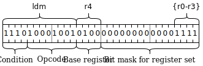

LDM—or *load multiple*—is my favorite assembly instruction of the ARM instruction set.
Here's why.

First, let's discuss what LDM does.
An example:

```
ldm r4, {r0, r1, r2, r3}
```

Here, it takes a *base register* (in this case, `r4`) and a *register set* (in this case, `{r0, r1, r2, r3}`).
It loads consequtive words from address in the base register into the registers in the set.
In this example, the effect could be described using the following C-like pseudo-code:

```c
r0 = r4[0];
r1 = r4[1];
r2 = r4[2];
r3 = r4[3];
```

Thats quite a few assignments for a single instruction!
And that's why it's called *load multiple*.

The set notation also allows for ranges.
Our previous example can be rewritten as follows:

```
ldm r4, {r0-r3}
```

Any and all of the 16 ARM registers are allowed in the set.
So, the following is legal:

```
ldm r0, {r0, r1, r2, r3, r4, r5, r6, r7, r8, r9, r10, r11, r12, r13, r14, r15}
```

The register set is encoded as a 16-bit mask in a 32-bit instruction.
Here's a simplified encoding of the original example:


{ width=75% }


Such instruction is a very good fit for a [load-store architecture](https://en.wikipedia.org/wiki/Load%E2%80%93store_architecture) like ARM, where the main workflow is:

* load many vlues from memory into registers,
* perform operations exclusively on registers,
* store results back from registers into memory.

The oposite of LDM is STM—*store multiple*.

<!---Since both of them operate on *sets* of registers (which are implemented as bit masks), you can't directly select the order in which the values are loaded or stored.
The set `{r0, r1, r2}` is the same as `{r2, r1, r0}`.
That's why-->


## Block copy

With these two you can copy large blocks of memory fast:

You can copy eight words (or 32 bytes!) of memory in just two instructions:

```
ldm r0, {r4-r11}
stm r1, {r4-r11}
```

LDM and STM have also auto-increment variants (denoted with "!") where the base register is incremented by the number of words loaded/stored, so you can do the copying in a fast loop:


```
ldm r0!, {r4-r11}
stm r1!, {r4-r11}
```

## Implementing stacks

ARM's POP instruction is simply an alias for LDM with a stack pointer (and auto-increment).
The following two are exactly the same:

```
ldm sp!, {r0-r3}
pop {r0-r3}
```

And the PUSH instruction is an alias for a STM variant (STMDB).

You can push and pop large quantitis from and to the stack in one go.
And if you replace SP by another register you can implement efficient stacks in other regions of memory.
For example, you can implement a [shadow stack](https://en.wikipedia.org/wiki/Shadow_stack) in the heap.

## Saving registers

Are you hesitating to use the call-preserved registers because you need to save them, and you might as well use a stack slot anyway?
Not any more, because you can save all call-preserved registers you want to use in one go:

```
push {r4-r11}
```


## Prologue and epilogue

On ARM first four arguments, the return address (LR) and the frame pointer (FP) are all passed in registers.
That's why it's especially important to have efficient prologues and epilogues.
Fortunately, you can save FP and LR in one go, using a fairly standard ARM prologue:

```
push {fp, lr}
```

And then restore both and return (for the epilogue):

```
pop {fp, lr}
bx lr
```

Even better, you can restore both and return in one go!

```
pop {fp, pc}
```

This works by popping the return address value (LR) into the program counter register (PC), so you don't need an explicit return!

This is good enough in itself, but you can also spill some arguments onto the stack (for example, if their address is taken):

    push {r0-r3, fp, lr}

Or, you can save FP and LR and, at the same time, allocate some words on the stack:

    push {r0-r3, fp, lr}

In this case we push `r0-r3` not for their value but to advance the stack pointer by four words.

## ARM64

I suspect it was a difficult trade-off, but when it was time to design the 64-bit version of the ARM instruction set, the decision was made to double the number of registers to 32.
I remember reading a papery saying that this change improves the performance by about 6% accross the board.
With 32 registers it is no longer possible to encode a bit mask of all registers into a 32-bit long instruction.
So, instead, ARM64 has LDP and STP: load pair and store pari, which are the spiritual successors of LDM and STM.


* * *

This blog post started out originally as a [Twitter thread](https://twitter.com/keleshev/status/1285654345988673536). [&#9632;](/ "Home")

* * *

<center><em>Check out my book:<br/>Compiling to Assembly from Scratch</em></center>


