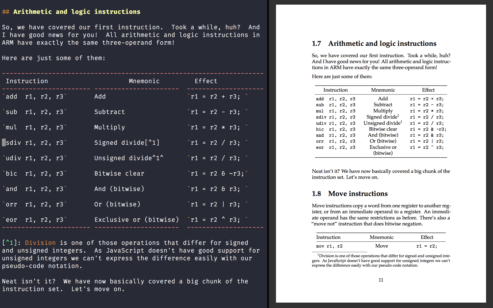

As you might know,
I'm writing a book called
[Compiling to Assembly from Scratch](/compiling-to-assembly-from-scratch/).
Recently I
[tweeted](https://twitter.com/keleshev/status/1246720964790046721)
about my book-writing setup, and
there was a lot of interest in the
details of my setup.
I'm only halfway through
with writing the book (or, so I think),
so my setup will likely to change as I go.
But here it is, anyway.

A screenshot:

<a href="./screenshot.png"></a>

I'm on macOS, so I'm using the native
full-screen split functionality.
On the left, I have Terminal.app running Vim,
and on the right, I have Preview.app
showing—ahem—a preview.
Both apps ship with macOS.

I'm writing the book in Markdown,
then use Pandoc to convert it to PDF and EPUB.

## Pandoc

I use [Pandoc](https://pandoc.org/) as my
Markdown processor.
It is a great tool, written in Haskell, and available
from most package managers.
It converts from and to many different document formats.
Still, I am mainly interested in PDF and EPUB for my book.

While Pandoc supports CommonMark and GitHub-flavored Markdown,
I am using the Pandoc dialect of Markdown.
It has support for many extensions:
footnotes, different styles of tables, math, etc.

For example, the table style that I'm using in the
screenshot allows changing column width and
proportions by changing the Markdown column widths.

Although I'm using Make to run Pandoc, here's
an equivalent shell command:

```txt
$ pandoc book.md -o book.pdf           \
    --table-of-contents                \
    --number-sections                  \
    --pdf-engine=xelatex               \
    --indented-code-classes=javascript \
    --highlight-style=monochrome       \
    -V mainfont="Palatino"             \
    -V documentclass=report            \
    -V papersize=A5                    \
    -V geometry:margin=1in
```

By default, to produce PDF, Pandoc converts the document to LaTeX first, then calls `pdflatex` to produce the PDF.
Howerver, with `--pdf-engine=xelatex` I opted in to use
XeTeX together with `xelatex` command to produce PDF.

First, XeTeX allows to use Unicode characters in the source
of the document. I'm quite accustomed to entering
en-dash and em-dash and other special characters
using option-key shortcuts on macOS.
Second, XeTeX allows to use arbitrary system's fonts,
and that's what I did with *Palatino*.

I've set up some preliminary paper size and margin
and LaTeX `documentclass`, but I will definitely be
tweaking them before releasing the book.

Producing EPUB with Pandoc also works fine,
but I'm sure I will do more tweaking there
as well:

<a href=epub.png></a>

## Figures

I've been using [draw.io](https://draw.io)
for various diagrams at work and for this blog.
But for the book, I wanted to use something open-source,
something reliable, something that would not
*incredible journey* me somewhere halfway through writing
the book, leaving me without a critical tool.

So I started searching, and imagine my surprise when
I learned that draw.io is, in fact,
[open-source](https://github.com/jgraph/drawio).
That was a relief!

<a href=drawio.png></a>

I've been using one big draw.io document so far
and I exported individual figures to SVG
by using *export selection* feature.

SVG is well supported with EPUB, since EPUB
is just glorified HTML and CSS under-the-hood.
For PDF output, Pandoc requires to install
`librsvg` (written in Rust) and handles
the conversion transparently.

## Makefile

Even though my book right now is written in a single
Markdown file, I started using Make anyway
from the get-go.
I'm using my system's build-in GNU Make.
Here's my Makefile:

```txt
.PHONY: phony

FIGURES = $(shell find . -name '*.svg')

PANDOCFLAGS =                        \
  --table-of-contents                \
  --pdf-engine=xelatex               \
  --from=markdown                    \
  --number-sections                  \
  --indented-code-classes=javascript \
  --highlight-style=monochrome       \
  -V mainfont="Palatino"             \
  -V documentclass=report            \
  -V papersize=A5                    \
  -V geometry:margin=1in

all: phony output/book.pdf

output/%.pdf: %.md $(FIGURES) Makefile | output
        pandoc $< -o $@ $(PANDOCFLAGS)

output/%.epub: %.md $(FIGURES) Makefile | output
        pandoc $< -o $@ $(PANDOCFLAGS)

output:
        mkdir ./output

clean: phony
        rm -rf ./output

open: phony output/book.pdf
        open output/book.pdf
```

A few things that are worth mentioning:

`Makefile` itself is a dependency of some rules.
This is done so that if I change a
font (or some other Pandoc flag),
Make would pick it up and rebuild the target.

The list of all figures (`*.svg` glob)
is a dependency as well, to make sure that the book
is rebuilt when a figure is updated.

The build artifacts are stored in the `output` folder,
which is an [order-only prerequisite](https://www.gnu.org/software/make/manual/html_node/Prerequisite-Types.html)
(specified with "`| output`" syntax).
This is useful because we don't care about the timestamp
of this directory, only that it exists.

Running "`make open`" uses macOS `open` command
(similar to `xdg-open` on Linux) to open
the PDF in Preview.app.
If it is already open, the Preview.app will refresh
the existing window.

I have a special "`.PHONY: phony`" rule, that
allows me to write:

```txt
clean: phony
        rm -rf ./output
```

Instead of the usual:

```txt
.PHONY: clean
clean:
        rm -rf ./output
```

Note that this trick can slow down huge Makefiles.

To be honest, this is mostly just me flexing my
knowledge of Make, rather than anything useful.
A small build script could do just as well.

## Vim

I am using the version of Vim that ships with macOS,
with minimal tuning.
One `~/.vimrc` option worth mentioning here
is `virtualedit`:

```vim
set virtualedit=all
```

It allows to move the cursor past the last character.
If you insert a new character there,
it is automatically padded with spaces.
It is easier to see it than to explain it:


This is very useful for dealing with tables and much more!
In fact, I use this option for all my editing
in Vim for about a decade now.
My first programming environment was
Turbo Pascal, and this is exactly how the
cursor worked there, which I grew accustomed to.

When I open the editor I write `:!make open`
to open the preview, and then use `:!!` to repeat
that command.
In fact, I have a shortcut that maps
the space bar to the combination of
saving the current file and running the previous command:

```vim
map <Space> :w<Enter>:!!<Enter>
```

This *save-file-and-repeat-last-command* command is
is useful for other things, for example, running
test suites.


* * *

And that's about it.
When I finish my book, I will write a new blog
post about any significant changes to this process.

